# 🚀 EXECUTER

<div align="center">

```
███████╗██╗  ██╗███████╗ ██████╗██╗   ██╗████████╗███████╗██████╗ 
██╔════╝╚██╗██╔╝██╔════╝██╔════╝██║   ██║╚══██╔══╝██╔════╝██╔══██╗
█████╗   ╚███╔╝ █████╗  ██║     ██║   ██║   ██║   █████╗  ██████╔╝
██╔══╝   ██╔██╗ ██╔══╝  ██║     ██║   ██║   ██║   ██╔══╝  ██╔══██╗
███████╗██╔╝ ██╗███████╗╚██████╗╚██████╔╝   ██║   ███████╗██║  ██║
╚══════╝╚═╝  ╚═╝╚══════╝ ╚═════╝ ╚═════╝    ╚═╝   ╚══════╝╚═╝  ╚═╝
```


<br/>


<br/>

### ⚡ **One command to make executable. One command to run. Done.**

<br/>

</div>

---

## 🎯 What Is EXECUTER?

```mermaid
graph LR
    A[📝 Script File] --> B[🚀 EXECUTER]
    B --> C[🔧 chmod +x]
    C --> D[▶️ Run Script]
    D --> E[✅ Results]
    style B fill:#ff6b35,stroke:#fff,stroke-width:3px,color:#fff
    style E fill:#00ff00,stroke:#fff,stroke-width:2px,color:#000
```

<div align="center">



</div>

EXECUTER is a powerful yet simple bash utility that **automates script execution** on Linux and macOS systems. Tired of typing `chmod +x script.sh` followed by `./script.sh` every single time? EXECUTER does both in **one smooth workflow**.

Perfect for developers, system administrators, DevOps engineers, and anyone who runs bash scripts regularly.

### 💡 The Problem It Solves

**Before EXECUTER:**
```bash
chmod +x my_script.sh        # Step 1: Make executable
./my_script.sh               # Step 2: Run it
# Rinse and repeat 100 times a day 😩
```

**With EXECUTER:**
```bash
./executer.sh               # One command
# Enter filename, confirm, done! ✨
```

---

## ✨ Key Features

<div align="center">

| Feature | Description | Benefit |
|---------|-------------|---------|
| 🎯 **Auto-Detection** | Checks if script is already executable | No redundant operations |
| ✅ **File Validation** | Verifies file exists before proceeding | Prevents errors early |
| 🛡️ **Safety Confirmation** | Asks before executing anything | Prevents accidents |
| 📊 **Status Reporting** | Shows current permissions and location | Full transparency |
| 🎨 **Beautiful Interface** | ASCII banner and clean prompts | Professional look |
| ⚠️ **Error Handling** | Catches failures gracefully | Never leaves you hanging |
| 🔍 **Exit Code Reporting** | Shows if script succeeded or failed | Debug faster |
| 📍 **Path Display** | Shows exact location of script | Know where you are |

</div>

---

## 🚀 Performance & Efficiency

<div align="center">

```diff
+ Saves 50% of typing time
+ Eliminates repetitive chmod commands
+ Prevents common permission errors
+ Professional workflow automation
```

| Task | Manual Way | With EXECUTER | Time Saved |
|------|-----------|---------------|------------|
| Run 1 script | 2 commands | 1 command | **50%** ⚡ |
| Run 10 scripts | 20 commands | 10 commands | **50%** ⚡ |
| Run 100 scripts | 200 commands | 100 commands | **50%** ⚡ |

**Plus: No typos, no forgotten chmod, no hassle!**

</div>

---

## 📦 Installation

<div align="center">

### ⚡ Quick Install

</div>

```bash
# Download the script
wget https://raw.githubusercontent.com/BENNIE047/EXECUTER/main/executer.sh

# Make EXECUTER itself executable (just once!)
chmod +x executer.sh

# Ready to use!
./executer.sh
```

<div align="center">

### 🌍 System-Wide Installation (Recommended)

For global access from any directory:

</div>

```bash
# Move to system binaries
sudo mv executer.sh /usr/local/bin/executer

# Now run from anywhere!
executer
```

<div align="center">

### 🎓 Alternative: Add to PATH

Keep it in your preferred location:

</div>

```bash
# Move to your scripts folder
mv executer.sh ~/scripts/

# Add to PATH in ~/.bashrc or ~/.zshrc
echo 'export PATH="$HOME/scripts:$PATH"' >> ~/.bashrc
source ~/.bashrc

# Use it anywhere!
executer.sh
```

<div align="center">


</div>

---

## 🛠️ Usage Guide

### Basic Workflow

<div align="center">


</div>

### Step-by-Step Example

**1. Run EXECUTER:**
```bash
./executer.sh
```

**2. You'll see the banner:**
```
███████╗██╗  ██╗███████╗ ██████╗██╗   ██╗████████╗███████╗██████╗ 
██╔════╝╚██╗██╔╝██╔════╝██╔════╝██║   ██║╚══██╔══╝██╔════╝██╔══██╗
█████╗   ╚███╔╝ █████╗  ██║     ██║   ██║   ██║   █████╗  ██████╔╝
██╔══╝   ██╔██╗ ██╔══╝  ██║     ██║   ██║   ██║   ██╔══╝  ██╔══██╗
███████╗██╔╝ ██╗███████╗╚██████╗╚██████╔╝   ██║   ███████╗██║  ██║
╚══════╝╚═╝  ╚═╝╚══════╝ ╚═════╝ ╚═════╝    ╚═╝   ╚══════╝╚═╝  ╚═╝

============================================
  🚀 Quick Script Executor & Runner v1.0
============================================
```

**3. Enter your script name:**
```
📝 Enter the script filename (e.g., script.sh): my_script.sh
⚙️  File is not executable yet...
```

**4. Review the summary:**
```
============================================
📄 File: my_script.sh
📍 Location: /home/benson/projects
🔧 Action: Make executable & run
============================================
```

**5. Confirm execution:**
```
⚠️  Execute and run this script? (y/n): y
```

**6. Watch it work:**
```
🔧 Making script executable...
✅ Script is now executable!

🚀 Running script...
============================================

[Your script output appears here]

============================================
✅ Script executed successfully!
============================================
🎉 EXECUTER COMPLETE
```

---

## 💡 Use Cases

```mermaid
mindmap
  root((EXECUTER))
    🔧 Development
      Test scripts
      Run builds
      Execute tests
      Deploy code
    📚 Learning
      Practice coding
      Try examples
      Debug errors
      Experiment
    ⚙️ Automation
      Run tasks
      Schedule jobs
      Batch process
      System admin
    🎓 Teaching
      Demo scripts
      Show examples
      Quick testing
      No manual setup
```

<div align="center">



</div>

### 🔧 For Developers

```bash
# Quick script testing during development
./executer.sh
# Enter: test_feature.sh
# Test, iterate, repeat!
```

### 🎓 For Students & Learners

```bash
# Learning bash? Focus on writing, not permissions!
./executer.sh
# Enter: my_practice.sh
# No distraction from chmod syntax
```

### ⚙️ For System Administrators

```bash
# Run maintenance scripts quickly
./executer.sh
# Enter: backup.sh
# Done in seconds!
```

### 🚀 For DevOps Engineers

```bash
# Execute deployment scripts
./executer.sh
# Enter: deploy_prod.sh
# Automated and safe
```

---

## 🎨 What Makes EXECUTER Unique?

<div align="center">

| Feature | Other Tools | EXECUTER |
|---------|-------------|----------|
| **Pre-execution checks** | ❌ | ✅ Auto-detects permissions |
| **Safety confirmation** | ❌ | ✅ Always asks before running |
| **Path display** | ❌ | ✅ Shows exact location |
| **Error reporting** | ⚠️ Basic | ✅ Detailed with exit codes |
| **Already executable?** | Runs chmod anyway | ✅ Skips if not needed |
| **Beautiful UI** | 😐 Plain text | ✅ ASCII art & emojis |
| **Exit code tracking** | ❌ | ✅ Reports success/failure |

</div>

### 🧠 Smart Features

**1. Intelligence:**
- Detects if script is already executable
- Shows current working directory
- Validates file existence before attempting anything

**2. Safety:**
- Always confirms before execution
- Handles errors gracefully
- Never leaves you guessing what happened

**3. User Experience:**
- Clean, professional interface
- Clear prompts and feedback
- Emoji-enhanced readability

---

## 🔧 Advanced Usage

### Working with Scripts in Different Directories

```bash
# EXECUTER works with full paths!
./executer.sh
📝 Enter the script filename: /home/user/scripts/backup.sh
```

### Running Multiple Scripts

```bash
# Run EXECUTER multiple times in sequence
for script in script1.sh script2.sh script3.sh; do
    echo "$script" | ./executer.sh
done
```

### Integration with Other Tools

```bash
# Use in automation pipelines
./executer.sh < input.txt  # Pipe in responses

# Or as part of larger workflows
./executer.sh && echo "Success!" || echo "Failed!"
```

---

## 📋 Requirements

<div align="center">

| Requirement | Details |
|-------------|---------|
| **Operating System** | Linux, macOS, or any Unix-like system |
| **Shell** | Bash 4.0 or higher (pre-installed) |
| **Permissions** | Read/write access to script files |
| **Disk Space** | ~5KB (yes, it's tiny!) |
| **Dependencies** | None! Pure bash |

</div>

---

## 🔍 How It Works Under The Hood

### The Magic Explained

```mermaid
flowchart TD
    A[Start EXECUTER] --> B{File exists?}
    B -->|No| C[❌ Error & Exit]
    B -->|Yes| D{Already executable?}
    D -->|Yes| E[✅ Note: Already executable]
    D -->|No| F[⚙️ Note: Not executable]
    E --> G[Show Summary]
    F --> G
    G --> H{User confirms?}
    H -->|No| I[❌ Cancel & Exit]
    H -->|Yes| J[Run chmod +x]
    J --> K{chmod success?}
    K -->|No| L[❌ Error & Exit]
    K -->|Yes| M[Execute Script]
    M --> N{Script exit code?}
    N -->|0| O[✅ Success!]
    N -->|Non-zero| P[⚠️ Error reported]
    O --> Q[Complete]
    P --> Q
```

<div align="center">



</div>

### Technical Breakdown

**1. Input Validation:**
```bash
if [ ! -f "$SCRIPT" ]; then
    echo "❌ Error: File '$SCRIPT' not found!"
    exit 1
fi
```
Checks if file exists before proceeding.

**2. Executable Detection:**
```bash
if [ -x "$SCRIPT" ]; then
    echo "✅ File is already executable!"
fi
```
Uses `-x` flag to check execution permissions.

**3. Safe Execution:**
```bash
chmod +x "$SCRIPT"
if [ $? -ne 0 ]; then
    echo "❌ Failed to make script executable!"
    exit 1
fi
```
Verifies chmod succeeded before running.

**4. Exit Code Capture:**
```bash
./"$SCRIPT"
if [ $? -eq 0 ]; then
    echo "✅ Script executed successfully!"
fi
```
Tracks script success/failure for reporting.

---

## ⚠️ Troubleshooting

### Common Issues & Solutions

<div align="center">

| Issue | Cause | Solution |
|-------|-------|----------|
| "File not found" | Wrong filename/path | Double-check spelling & location |
| "Permission denied" | No write access | Use `sudo` or check file ownership |
| "Command not found" | Missing shebang in script | Add `#!/bin/bash` to script |
| Script doesn't run | Wrong interpreter | Check shebang matches script type |

</div>

### Detailed Solutions

**Problem: "File not found"**
```bash
# Check if file exists
ls -la my_script.sh

# Use full path if in different directory
./executer.sh
📝 Enter: /full/path/to/script.sh
```

**Problem: "Permission denied" on chmod**
```bash
# Check file ownership
ls -l my_script.sh

# If needed, run with sudo
sudo ./executer.sh
```

**Problem: Script runs but does nothing**
```bash
# Ensure script has proper shebang
head -1 my_script.sh
# Should show: #!/bin/bash

# Add if missing
echo '#!/bin/bash' | cat - my_script.sh > temp && mv temp my_script.sh
```

---

## 🎓 Learning Resources

### Understanding The Code

New to bash? Here's what EXECUTER teaches:

- **File testing:** `-f`, `-x`, `-d` flags
- **Exit codes:** `$?` variable and error handling
- **User input:** `read` command
- **Conditionals:** `if/then/else` statements
- **Path manipulation:** `pwd`, `dirname`

### Further Learning

- [Bash Scripting Guide](https://www.gnu.org/software/bash/manual/)
- [File Permissions Explained](https://www.gnu.org/software/coreutils/manual/html_node/chmod-invocation.html)
- [Exit Codes in Bash](https://tldp.org/LDP/abs/html/exitcodes.html)
- [Shell Scripting Best Practices](https://google.github.io/styleguide/shellguide.html)

---

## 🤝 Contributing

Found a bug? Have an awesome feature idea? Contributions are welcome!

### How to Contribute

1. **Fork the repository**
2. **Create a feature branch**
   ```bash
   git checkout -b feature/amazing-feature
   ```
3. **Make your changes**
4. **Test thoroughly**
5. **Commit with clear messages**
   ```bash
   git commit -m "Add: Support for Python scripts"
   ```
6. **Push to your branch**
   ```bash
   git push origin feature/amazing-feature
   ```
7. **Open a Pull Request**

### Ideas for Enhancement

- [ ] Support for multiple scripts at once
- [ ] Integration with text editors
- [ ] Logging of execution history
- [ ] Script argument passing
- [ ] Color theme customization
- [ ] Interactive script selection (menu)
- [ ] Favorites/bookmark system

---

## 💬 FAQ

**Q: Can I use EXECUTER with Python scripts?**  
A: Yes! Any script with a proper shebang (`#!/usr/bin/python3`) will work.

**Q: Does it work with Ruby, Perl, or other languages?**  
A: Absolutely! As long as the script has the correct shebang.

**Q: Will it work on Windows?**  
A: You'll need WSL (Windows Subsystem for Linux) or Git Bash.

**Q: Can I pass arguments to my script?**  
A: Currently no, but this is a planned feature! For now, edit your script to prompt for input.

**Q: What if my script name has spaces?**  
A: EXECUTER handles spaces correctly! Just type the full name.

**Q: Is it safe to use with production scripts?**  
A: Yes! The confirmation step prevents accidental execution.

**Q: Can I customize the banner?**  
A: Yes! Edit lines 8-14 in the script to change the ASCII art.

**Q: Does it require root/sudo?**  
A: Only if you're running scripts that require elevated permissions.

---

## 📊 Project Stats

<div align="center">


<br/>


</div>

---

## 📝 License

**Free and Open Source**

Use it, modify it, share it, sell it. No restrictions whatsoever.

Built for the community, by the community.

---

## 🙏 Acknowledgments

Inspired by developers worldwide who got tired of typing the same two commands over and over.

Special thanks to:
- The Bash community for incredible documentation
- Everyone who's ever forgotten to `chmod +x` a script
- You, for checking out EXECUTER!

---

## 🌟 Why Choose EXECUTER?

<div align="center">

```
┌─────────────────────────────────────────┐
│  "The simplest tools are often the      │
│   most powerful." - Unknown             │
└─────────────────────────────────────────┘
```

**EXECUTER isn't trying to be everything.**

It does **one thing**, and it does it **really well**:
- Makes your scripts executable
- Runs them immediately
- Shows you what happened

**No bloat. No complexity. Just results.** ✨

</div>

---

## 📞 Support & Contact

<div align="center">

Having issues? Want to share feedback? Reach out!

**GitHub Issues:** [Report a bug](https://github.com/BENNIE047/EXECUTER/issues)  
**Instagram:** [@Idk._bennie](https://instagram.com/Idk._bennie)

<br/>

---

**⚡ EXECUTER v1.0**


<br/>

Made with 💙 and ⚡ by [BENNIE047](https://github.com/BENNIE047)

*Because great tools should be simple.*

<br/>

[](https://github.com/BENNIE047)
[](https://instagram.com/Idk._bennie)

<br/>


<br/>

```
⭐ If EXECUTER saved you time, show some love with a star! ⭐
```

</div>
